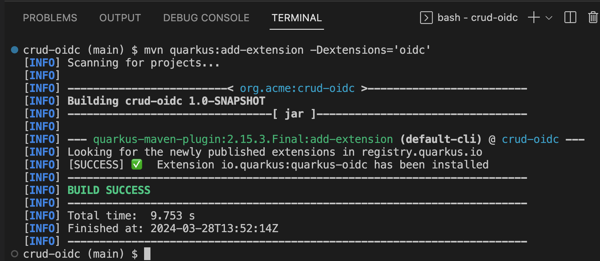

# Securing Cloud native apps (Optional!!!)

Welcome to the last lab of this workshop. When we write distributed services e.g. in a Cloud-native microservices architecture we end up spreading our business logic over to multiple distributed end points. This creates a challenge for securing applications as now the same logic is deployed and distributed across networks or even regions etc. Red Hat SSO provides that central authentication and authorization mechanism that services can leverage. How does this work you might ask? Lets dig into this lab and find out how to secure a cloud-native microservice written with the popular Java framework Quarkus.

## What is Quarkus?


Quarkus is a Kubernetes Native Java stack tailored for GraalVM & OpenJDK HotSpot, crafted from the best of breed Java libraries and standards. Amazingly fast boot time, incredibly low RSS memory (not just heap size!) offering near instant scale up and high density memory utilization in container orchestration platforms like Kubernetes. Quarkus uses a technique called compile time boot and offers a unified imperative and reactive programming model and a number of other developer features like Live Reload to bring real joy to your development.

Red Hat offers the fully supported Red Hat Build of Quarkus(RHBQ) with support and maintenance of Quarkus. In this workhop, you will use Quarkus to develop Kubernetes-native microservices and deploy them to OpenShift. Quarkus is one of the runtimes included in Red Hat Runtimes. Learn more about RHBQ.

Lets create a Quarkus books service. To do that the first thing we need is our data model. Lets create the Book Entity that will store books in our database. The following diagram shows our final deployment.

1. SSO - Instance of our Red Hat SSO, we add a new realm to it during the lab for this config.

2. crud-oidc - is our Quarkus books service. With a Book entity that stores data in a database and a REST API end point BookResource

3. books-database - An instance of PostgreSQL where we store our data.

    

## Create Books entity

To create our Book entity we are going to use Panache. Hibernate ORM is the de facto JPA implementation and offers you the full breadth of an Object Relational Mapper. It makes complex mappings possible, but it does not make simple and common mappings trivial. Hibernate ORM with Panache focuses on making your entities trivial and fun to write in Quarkus. Lets start by defining the fields we want to store in a Book entity.

- Back to OpenShift Dev Spaces, in Explorer, go to crud-oidc --> src/main --> java/org/acme --> Book.java
- Paste the below code into our Books.java class
  
  ```java
    @NotNull
    @NotBlank
    public String title; 
    public String genre; 
    @Column(unique = true)
    @NotNull
    @Id
    public String isbn; 
    @Column(columnDefinition = "TEXT")
    public String summary; 
  ```

  - Title of a book which should not be blank or null.
  - Genre of a book.
  - ISBN which is a unique id and it should not be null either.
  - And summary which could be a long text descrbing a book.
  - Paste the above code into our Books.java class

- Paste the code snippet above into our Book.java entity.

  ```java
    public static List<Book> getAll(){ 
        return listAll();
    }

    public static Book getOne(String isbn){
        return findById(isbn);
    }
  ```

  - the listAll() method might be surprising at first. It takes fragments of HQL (JP-QL) queries and contextualizes the rest. That makes for very concise but yet readable code.

- Example result of Book.java after add code
  
  

- What was described above is essentially the active record pattern, sometimes just called the entity pattern. Hibernate with Panache also allows for the use of the more classical repository pattern via PanacheRepository.

## Create Books Resource

- Perfect by now we have a Book entity, but we also want our service to be able to expose the data via an end point. For that lets create our REST API.
- Copy the following code and add it to the BooksResource.java

  ```java
    @GET 
    @Produces(MediaType.APPLICATION_JSON)

    public List<Book> getAll() {
        return Book.listAll(); 

    }

    @GET
    @Path("/{isbn}")
    public Book getOne(@PathParam("isbn") String isbn) { 
        Book entity = Book.findById(isbn); 
        if (entity == null) {
            throw new WebApplicationException("Book with id of " + isbn + " does not exist.", Response.Status.NOT_FOUND);
        }
        return entity;
    }
  ```

  - This is the GET endpoint for all the books serving on /books
  - Here we use the power of Panache by calling on our entity and listing all the books without providing any queries etc.
  - This is also a get request but for one book only using our unique identifier isbn which should be passed in to the URI.
  - Finally we look for the Book with the isbn passed using the Panache entity.

- Lets also add our POST method. So users of this service can also add books they like.

  ```java
    @POST
    @Transactional
    public Response create(@Valid Book item) { 
        item.persist(); 
        return Response.status(Response.Status.CREATED).entity(item).build();
    }
  ```

  - the POST method expects a valid JSON for the Book.
  - Once it has been validated it is then persisted into our database by using the PanacheEntity’s persist method.

- We also should add a PUT request method incase our users would also want to update the data about a given book.

  ```java
    @PUT
    @Path("/{id}") 
    @Transactional
    public Response update(@Valid Book book, @PathParam("id") String isbn) {
        Book entity = Book.findById(isbn);
        entity.title = book.title;
        entity.genre = book.genre;
        entity.summary = book.summary;
        return Response.ok(entity).build();
    }
  ```

  - this request would be served on /books/id which in this case is an isbn code.

- Finally lets add our DELETE method as well to delete any books.

  ```java
    @DELETE
    @Path("/{isbn}")
    @Transactional
    public Response deleteOne(@PathParam("isbn") String isbn) {
        Book entity = Book.findById(isbn);
        if (entity == null) {
            throw new WebApplicationException("Book with isbn of " + isbn + " does not exist.", Response.Status.NOT_FOUND);
        }
        entity.delete();
        // typically it should be an empty response on success. hre we are explicitly sending the entity deleted back.
        return Response.status(Response.Status.CREATED).entity(entity).build();
    }
  ```

- Example Result of BookResource.java after add code
  
    

    

- Great! Now we have an Entity to store the data in our PostgreSQL database and a REST end point for the users of our service to communicate with.

## Deploy to OpenShift

Before we start to deploy our application we also need to deploy that database to the OpenShift cluster so that are code and reference it and store values into it.

- open terminal in OpenShift Dev Spaces
- check project and go to project path (change userX to your username)
  
  ```ssh
  oc project userX-keycloak 
  cd /projects/keycloak-workshop-labs
  cd crud-oidc/
  ```

- The following command will create a database called books-database and thats how we will reference it in our app settings later on as well. Run this command in your CodeReady terminal

  ```ssh
  oc new-app -e POSTGRESQL_USER=quarkus \
    -e POSTGRESQL_PASSWORD=quarkus \
    -e POSTGRESQL_DATABASE=books \
    openshift/postgresql:latest \
    --name=books-database
  ```

- Once you have ran the command you should similar output as follows

  ```ssh
  .
  .
  --> Creating resources ...
      deployment.apps "books-database" created
      service "books-database" created
  --> Success
      Application is not exposed. You can expose services to the outside world by executing one or more of the commands below:
      oc expose service/books-database
      Run 'oc status' to view your app.
  ```

- If you go back to the developer console Topology view in OpenShift you should see the database deployed as follows

  

Perfect! now we have our database deployed. Lets also deploy the application. For that we will first need to ensure we have the right database configuration. Quarkus uses its pre-built OpenShift extension to deploy apps to OpenShift. This way the developer does not need to worry about all the different Kubernetes manifests/yaml files that needs to be created. Its taken care of by Quarkus. This is great, because now all we need to do is give some parameters into our application.properties and we are all set to deploy. 

- Open up the application.properties file in your OpenShift Dev Spaces. You should be able to find it on this path crud-oidc/src/main/resources/application.properties.

- Add below config in application.properties

  ```prop 
  quarkus.hibernate-orm.database.generation=drop-and-create
  quarkus.hibernate-orm.sql-load-script=import.sql
  quarkus.datasource.username=quarkus
  quarkus.datasource.password=quarkus
  quarkus.datasource.jdbc.url=jdbc:postgresql://books-database:5432/books
  quarkus.datasource.db-kind=postgresql
  
  quarkus.http.cors=true
  quarkus.kubernetes-client.trust-certs=true
  quarkus.openshift.route.expose=true
  ```

  

  - This is the resource we are trying to hit. in our case its the books-database instance of PostgreSQL and the name of the datbase is books. which is listening to the default port of 5432. This database is not exposed outside our namespace.
  - We also want that once our application is deployed it will automatically create a route in Openshift. We do not need to do it manually and this is where the OpenShift extension in Quarkus is so powerful. If you use other deployment tools like Jib or you want to build your own containers there are extensions for that too listed here; Container images with Quarkus
  - By default Quarkus will pick-up the import.sql file while developing and using Dev services. however here we are explicitly asking Quarkus to import the sql into the database once the applications is initialized. In our case so we have some startup data to play with.

- Now that we have all the configuration set, lets deploy our application to OpenShift. The following command will
  - Compile our code.
  - Package our code in to Java Jar archive
  - Create a build config in Openshift
  - Start the build, which will have an image as its end result.
  - Create a Deployment Config in OpenShift
  - Finally create a public route to our service.

- Lets run this command in the OpenShift Dev Spaces Terminal. Make sure you are in the project directory crud-oidc when you do this.

  ```ssh
    mvn clean compile package -Dquarkus.kubernetes.deploy=true
  ```

- The command will take a few seconds to run. While we wait for it to complete. You can also check the status in the Openshift developer console.
  
  

  

- Okay lets head back to our CodeReady and check if our service brought the data we require.

- Run the following command in the terminal (change userX to your user name)

  ```ssh
  curl -v -GET http://crud-oidc-userX-keycloak.apps.cluster-t9pz8.t9pz8.sandbox502.opentlc.com/books
  ```

- This should render an output with JSON output with details of books. You can hit the same URL in your browser and it should just render the JSON itself.

- Lets add try to do a couple more operations to the (change userX to your username)

  ```ssh
  # Gets all books
  curl -X GET http://crud-oidc-userX-keycloak.apps.cluster-t9pz8.t9pz8.sandbox502.opentlc.com/books

  # Get one book
  curl -X GET http://crud-oidc-userX-keycloak.apps.cluster-t9pz8.t9pz8.sandbox502.opentlc.com/books/978-0-321-96551-6

  # Delete a book
  curl -X DELETE http://crud-oidc-userX-keycloak.apps.cluster-t9pz8.t9pz8.sandbox502.opentlc.com/books/978-0-321-96551-6

  # Create a new book
  curl -X POST -H 'Content-Type: application/json' http://crud-oidc-userX-keycloak.apps.cluster-t9pz8.t9pz8.sandbox502.opentlc.com/books -d @temp.json

  # Update a book
  curl -X PUT -H 'Content-Type: application/json' http://crud-oidc-userX-keycloak.apps.cluster-t9pz8.t9pz8.sandbox502.opentlc.com/books/978-0-321-96551-7 -d @temp.json
  ```

  example result

  

Perfect! So by now we have added our API endpoint /books using Quarkus. And we also have our database setup. And you might have noticed that our endpoint is publicly available. This means its available for anyone to do all these operations without them being authenticated or authorized to do so. This has left our service open to intruders and this is not good! Lets try to secure this application

## Setup SSO

Lets start with configuring SSO first.

We will create a new realm by exporing the realm config file. To do that download the [Quarkus-realm](https://raw.githubusercontent.com/RedHat-Middleware-Workshops/keycloak-workshop-labs/main/crud-oidc/src/main/resources/quarkus-realm.json) config file to your own machine.

Login to your SSO instance again (change userX to your username); https://sso-userX-keycloak.apps.cluster-t9pz8.t9pz8.sandbox502.opentlc.com

1. Add a new realm by pressing the Add Realm button on the left side

  

2. Then press the button Select file and select the downloaded file from your local machine.

  

3. Once done press Create button to create our new realm called quarkus.

  

Now we should have a realm imported. Select Quarkus realm and press on Clients Here you will see that there is already a backend-service client added. This is the client for our backend-service.

  

Notice that the Access Type is confidential. By specifying this proprety we are telling SSO that this client will be authenticated by a confidential secret. This is for Bearer-only services that are not end-use services but to be consumed by other services or front ends. Furthermore if you click on the Credentials tab. you will also notice a client secret that we will use on our code. At this point do not regnerate the secret

Perfect! Now we are at a point that we need to configure our backend service to start authenticating against SSO

- back to OpenShift Dev Space, Open up the application.properties file in your OpenShift Dev Spaces. You should be able to find it on this path crud-oidc/src/main/resources/application.properties.
- add below properties 
  
```prop
quarkus.oidc.auth-server-url=https://sso-userX-keycloak.apps.cluster-t9pz8.t9pz8.sandbox502.opentlc.com/auth/realms/quarkus 
quarkus.oidc.client-id=backend-service 
quarkus.oidc.credentials.secret=secret 
```


Copy the above properties in the application.properties file. first prop is the authenticatin url that our Quarkus application will use to establish authentication. second prop is name of our client. should be similar to the one in our realm config. third prop is our confidential secret to authenticate the backend-service.

## Add OIDC annotations

Now that we have the application config added, we also need to update our code and add the Quarkus OIDC extension.

You can use the Quarkus OpenID Connect (OIDC) extension to secure your JAX-RS applications using Bearer Token Authorization. The Bearer Tokens are issued by OIDC and OAuth 2.0 compliant authorization servers, such as Red Hat SSO. Bearer Token Authorization is the process of authorizing HTTP requests based on the existence and validity of a Bearer Token. The Bearer Token provides information about the subject of the call which is used to determine whether or not an HTTP resource can be accessed.

To add the extenstion run the following command in terminal

```ssh
mvn quarkus:add-extension -Dextensions='oidc'
```



Now that we have all the dependencies required. Lets add the following imports to our BookResource.java

```java
import org.jboss.resteasy.reactive.NoCache; 
import javax.annotation.security.RolesAllowed; 
```

While @Cache builds a complex Cache-Control header, @NoCache is a simplified notation to say that you don’t want anything cached; i.e. Cache-Control: nocache. These annotations can be put on the resource class or interface and specifies a default cache value for each @GET resource method. Or they can be put individually on each @GET resource method.

The @RolesAllowed annotation is used to declaratively enforce the access constraint

- Add the annotations on top of each method. Add oidc annotations

```java
@RolesAllowed("user")
@NoCache
```


## Deploy to OpenShift

Perfect now we have everything set and ready to go for deployment. Lets deploy to OpenShift with the following command.

```ssh
   mvn clean compile package -Dquarkus.kubernetes.deploy=true
```

## Test the service

We have two roles in SSO at this point. - User - Admin

To start with lets authenticate with our user Alice who has role user.

As a first we need to first authenticate with SSO to ensure we have a valid token to hit our backend service. This applies to any service that will hit our end point. In the following command we our sending a request to SSO for the realm quarkus to authenticate with username=alice and we store the resulting token into access_token on our console as an environment variable so we can reuse it in our books end point requests.

```ssh
 export access_token=$(\
    curl --insecure -X POST https://sso-userX-keycloak.apps.cluster-t9pz8.t9pz8.sandbox502.opentlc.com/auth/realms/quarkus/protocol/openid-connect/token \
    --user backend-service:secret \
    -H 'content-type: application/x-www-form-urlencoded' \
    -d 'username=alice&password=alice&grant_type=password' | jq --raw-output '.access_token' \
 )
```

example result


Now lets try to curl our endpoints again but this time with the addition of Authentication: Bearer token. This will add the our authentication token for user alice into our request. (change userX to your username)

```ssh
# Gets all books
curl -X GET http://crud-oidc-userX-keycloak.apps.cluster-t9pz8.t9pz8.sandbox502.opentlc.com/books -H "Authorization: Bearer "$access_token -v

# Get one book
curl -X GET http://crud-oidc-userX-keycloak.apps.cluster-t9pz8.t9pz8.sandbox502.opentlc.com/books/978-0-321-96551-6 -H "Authorization: Bearer "$access_token -v

# Delete a book
curl -X DELETE http://crud-oidc-userX-keycloak.apps.cluster-t9pz8.t9pz8.sandbox502.opentlc.com/books/978-0-321-96551-6 -H "Authorization: Bearer "$access_token -v

# Create a new book
curl -X POST -H 'Content-Type: application/json' http://crud-oidc-userX-keycloak.apps.cluster-t9pz8.t9pz8.sandbox502.opentlc.com/books -d @temp.json -H "Authorization: Bearer "$access_token -v

# Update a book
curl -X PUT -H 'Content-Type: application/json' http://crud-oidc-userX-keycloak.apps.cluster-t9pz8.t9pz8.sandbox502.opentlc.com/books/978-0-321-96551-7 -d @temp.json -H "Authorization: Bearer "$access_token -v
```

At this point we have all our end points allowing the role user. But maybe we dont want. What if we want the DELETE, PUT, POST to have a different user role to ensure its only done by a privilaged user. With Quarkus OIDC its possible to do this too. Lets replace our DELETE, POST, PUT @RolesAllowed annotations as follows.

  ```java
    @RolesAllowed("admin")
    @NoCache
  ```

Now if we try to run our curl requests again, you can notice that it doesnt give any response. You should be able to notice a similar output in the log as follows with 403 forbidden. As Alice is no longer allowed to access those endppiont.

```ssh
* Mark bundle as not supporting multiuse
< HTTP/1.1 403 Forbidden
< content-length: 0
< set-cookie: ecfc3d849f2c9256ca51a1627576daa1=ebeaf971b02045e11bfa3a065d5d6f57; path=/; HttpOnly
```

Try to autheticate again with user admin instead as shown below. The following command will get the token for admin and update the environment variable. (change userX to your username)

```ssh
 export access_token=$(\
    curl --insecure -X POST https://sso-userX-keycloak.apps.cluster-t9pz8.t9pz8.sandbox502.opentlc.com/auth/realms/quarkus/protocol/openid-connect/token \
    --user backend-service:secret \
    -H 'content-type: application/x-www-form-urlencoded' \
    -d 'username=admin&password=admin&grant_type=password' | jq --raw-output '.access_token' \
 )
```

This time the requests will go through and you should be able to see the response from the server with the following log message.

```ssh
* Mark bundle as not supporting multiuse
< HTTP/1.1 201 Created
< content-type: application/json;charset=UTF-8
< content-length: 525
< cache-control: no-cache
< set-cookie: ecfc3d849f2c9256ca51a1627576daa1=ebeaf971b02045e11bfa3a065d5d6f57; path=/; HttpOnly
```

## Congratulations!

In this lab we learned some of the basic concepts of authentication for microservice in a Cloud-native world.

1. We created a Quarkus based BookService using Panache and RestEasy

2. We secured our service with OpenID Connect (OIDC) extension

3. We learnt how to configure a backen-service that uses a bearer token only.

4. And we finally deployed to our favourite kubernetes platform OpenShift.