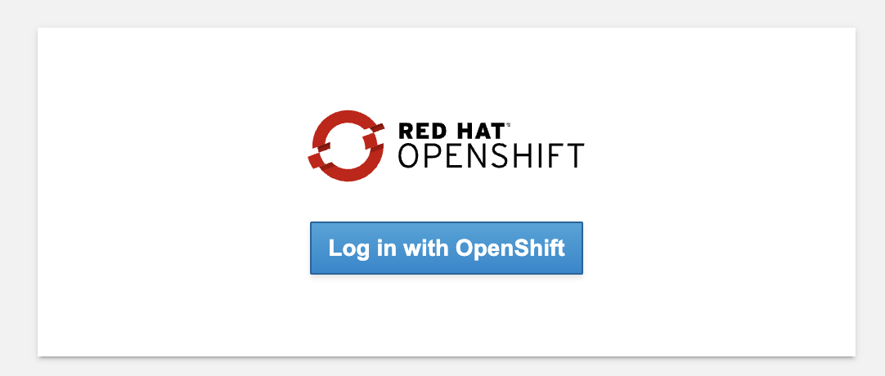
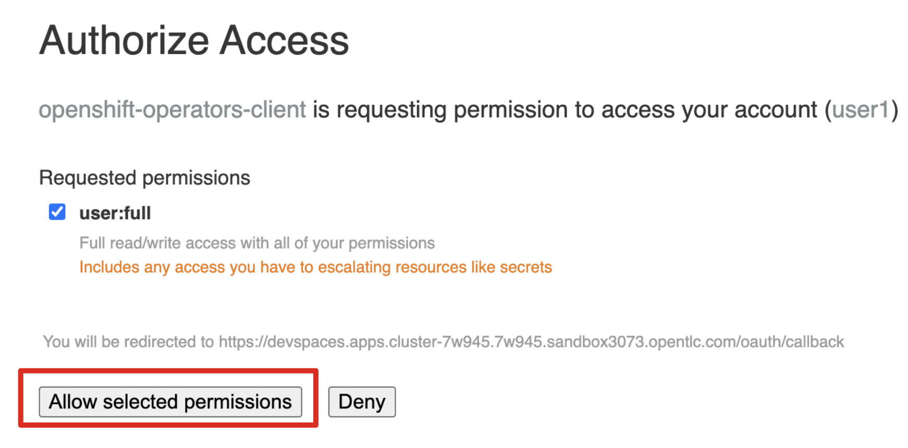

# Setting Up

## The Workshop Environment You Are Using

Your workshop environment consists of several components which have been pre-installed and are ready to use. Depending on which parts of the workshop you’re doing, you will use one or more of:

- Red Hat OpenShift - You’ll use one or more projects (Kubernetes namespaces) that are your own and are isolated from other workshop students

- Red Hat OpenShift Dev Spaces - Built on the open Eclipse Che project, Red Hat OpenShift Dev Spaces uses Kubernetes and containers to provide any member of the development or IT team with a consistent, secure, and zero-configuration development environment. The experience is as fast and familiar as an integrated development environment on your laptop. OpenShift Dev Spaces is included with your OpenShift subscription and is available in the Operator Hub. It provides development teams a faster and more reliable foundation on which to work, and it gives operations centralized control and peace of mind.

- Red Hat Runtimes - a collection of cloud-native runtimes and platform that enables Spring Boot, Node.js, and Quarkus developers to create Cloud-native apps with ease.

## Using OpenShift Dev Spaces

You will be using Visual Studio Code (VS Code) based on Red Hat OpenShift Dev Spaces. Changes to files are auto-saved every few seconds, so you don’t need to explicitly save changes.

- To get started, Open this link which should take you to the Dev Spaces console and press Log in with OpenShift button:

  - Open OpenShift Dev Space Link : [openshift dev space](https://devspaces.apps.cluster-29pc5.29pc5.sandbox855.opentlc.com/) 

  - Click Log in with OpenShift Button
    

- Type in the following credentials:

    Username: userX  --> change user X to your username

    Password: openshift

    

- In case you see the Authorize Access page as below, select Allow selected permissions button.
  
  

- Once you log in, you’ll be placed on the Create Workspace dashboard. Copy the following Git Repo URL to Import from Git, and select Create & Open.

  - Git Repo URL: https://github.com/RedHat-Middleware-Workshops/keycloak-workshop-labs.git

    

- A new window or tab in your web browser will open automatically to showcase the progess about Starting workspace quarkus-workshop. It takes roughly about 60 seconds to finish the process.

  

- After a few seconds, you’ll be placed in the workspace.
  
  

- In case you see this infomation page, check on Trust the authors of all files in the parent folder 'projects'. Then, select Yes, I trust the authors. Trust folder and enable all features.
  
  

- Select Mark Done for accept all default VS Code Configuration
  
  

- You’ll use all of these during the course of this workshop, so keep this browser tab open throughout. If things get weird, you can simply reload the browser tab to refresh the view.

- if you copy command line from hand-on lab to terminal in OpenShift Dev Spaces, Please click allow popup to allow paste data/text to terminal !!! 
  
  

  

## Next Step
- [Getting started with RH-SSO](3-getting.md)