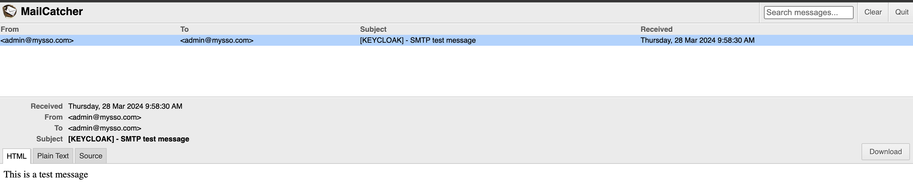
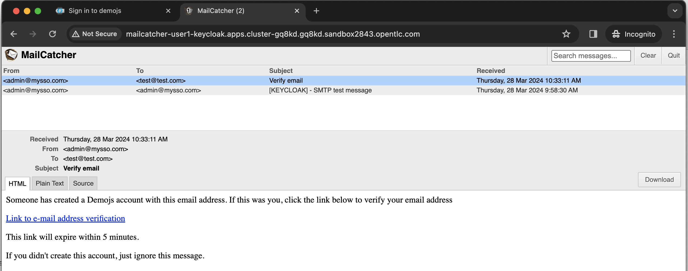

# Configuring RH-SSO

Now that we have the server installed, lets make a few basic configuration changes to get started.

In this section we will view some of the current configuration and also add smtp config and email addresses so that our SSO server can communicate with the end users. We will then test our flow with Email verification and user registrations.

## What is a Realm

A realm is the logical namespace for all configurations, options, for a given group or applications or services. A realm secures and manages security metadata for a set of users, applications, and registered identity brokers, clients etc. Users can be created within a specific realm within the Administration console. Roles (permission types) can be defined at the realm level and you can also set up user role mappings to assign these permissions to specific users. A user belongs to and logs into a realm. Realms are isolated from one another and can only manage and authenticate the users that they control.

So whats the difference between the Master Realm that was already created and why did we create a new one?

## The Master Realm

The initial realm is the master realm. It is the highest level in the hierarchy of realms. Admin accounts in this realm have permissions to view and manage any other realm created on the server instance. When you define your initial admin account, you create an account in the master realm. Your initial login to the admin console will also be via the master realm.

It is recommended that you do not use the master realm to manage the users and applications in your organization. Reserve use of the master realm for super admins to create and manage the realms in your system. Following this security model helps prevent accidental changes and follows the tradition of permitting user accounts access to only those privileges and powers necessary for the successful completion of their current task.

It is possible to disable the master realm and define admin accounts within each individual new realm you create. Each realm has its own dedicated Admin Console that you can log into with local accounts.

## Setting up email integration

With Single Sign-On we expect there will be users logging in, there is integration to OAuth etc. Obviously we need to have an email integration so SSO server can send verfication emails etc.

- Go to Terminal in OpenShift Dev Spaces
  
  

- Now you can run the following commands in the terminal you just opened.
  
  ```ssh
  oc new-app quay.io/sshaaf/mailcatcher --name=mailcatcher

  oc expose svc/mailcatcher --port 8080
  ```

  example output

  

  - the first command will initiate the mailcatcher server
  - the second ones exposes the port 8080 to ensure we have the http end point setup for viewing the emails recieved.

- back to OpenShift Console, in your project (userX-keycloak, change userX to your username), select Topology and view mailcatcher pod
  
  

- Lets configure our new realm demojs. Just a small config we should do before that. Since we plan to use emails lets add the Admin email account details too.

- Ensure you are logged into the SSO admin console. Once logged in click on menu at the right hand corner of the SSO Admin console.

  

- Click on Manage account, this will bring you to the Admin user profile.
- Click Personal Info Link
  
  

- In Personal Info, set below value
  
  

  - Email: admin@mysso.com
  - First name: admin
  - Last name: sso
  - Click save

- Click Back to Security Admin Console
  
  

- Now goto the realm settings by clicking on the demojs Realm.
- Press the email Tab, and lets configure it.

  - set Host: mailcatcher
  - set Port: 1025
  - set From Display Name: admin sso
  - set From: admin@mysso.com
  - click save
  
  
  
- Now lets make a quick test. Click Test Connection, once pressed will report back if your configuration was successful. If it is, an email should arrive in your inbox, with a subject e.g. '[KEYCLOAK] - SMTP test message'
- Back to OpenShift Console, in Topology View, click mailcatcher and click link at right top of mailcatcher icon or click link at Routes in mailcatcher side panel (check your url!!! mailcatcher used HTTP, not HTTPS) 
  
  

- View Test Email from SSO in MailCatcher
  
  

- Perfect, now we have the email configuration. Back to SSO Admin Console, Lets move on to the Login tab.
- Enable the following: (change to ON)

  

  - User Registration , User registration allows new users to register to the SSO
  - Verify Email , and this will ensure that we can verify the user by thier email.
  - Press Save

- Now lets test our basic config. Open a new browser session in privacy mode, or open another browser (such as google chrome incognito mode).

  

- Ensure that you are not logged into the SSO admin panel in the newly opened browser sessions.
- Link to the console (!!! change userX to your username !!!): https://sso-userX-keycloak.apps.cluster-t9pz8.t9pz8.sandbox502.opentlc.com/auth/realms/demojs/account

  

- Click Sign In (top right!!!)
- It should show a login screen, with a link under the buttons to register.
  
  

- Hit the register button and register a new user.
  - Ensure that you fill in the an email address, since an email will be sent to verify the newly created user. 
  - ensure that this email address is not the same as used previously in this excercise. The email will land in our mailcatcher web-ui.
  - Example :
    - First name: test
    - Last name: test
    - Email: test@test.com
    - Username: test
    - Password: password

  

- Once you have registered you should see the following message:

  

- Head over to your email and you should have recieved a new email. Copy Email URL and Open it in same current register browser (not admin).
- Click on the link in the email to verify this new user. 
  
  

- Now you should be able to login to the admin console with your new user.
  
  

## Let’s move on

Great, so now we have some basic config for our RH-SSO server and its realm. Lets head off to the next section where we will deploy our first application. And subsequently configure it to use RH-SSO.

- [Simple JS Console Application](5-jsconsole.md)