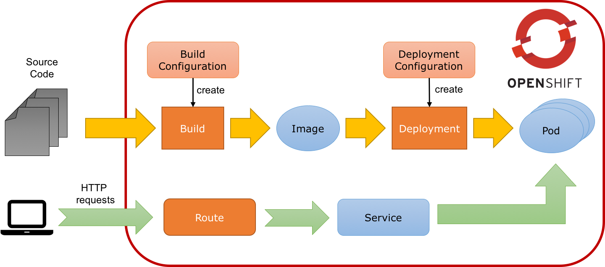
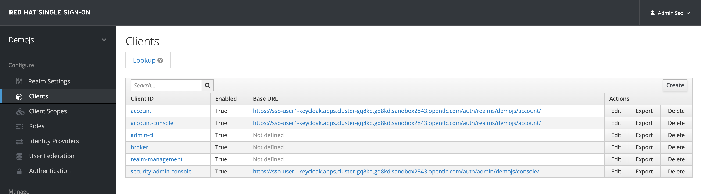

# Simple JS Console Application

Following a microservice approach will help you increase your agility. However, it does not come for free and requires a lot of discipline. It also stresses your deployment facilities. When the number of microservices grows, it very quickly becomes an issue to keep your system on track.

To help us with this, containers are a great packaging and runtime technology. Your application runs in an isolated container, avoiding resource conflicts. But to deploy a set of containers and keep them coordinated, you need a container platform. That’s what Kubernetes is. Kubernetes defines a set of building blocks ("primitives") which collectively provide mechanisms for deploying, maintaining, and scaling applications packaged inside containers. OpenShift extends Kubernetes with build automation and a routing system, while inheriting all the primitives from Kubernetes.


## Primitives

### Pod

The basic scheduling unit in Kubernetes is called a pod. It adds a higher level of abstraction to containerized components. A pod consists of one or more containers that are guaranteed to be co-located on the host machine and can share resources. Each pod in Kubernetes is assigned a unique (within the cluster) IP address, which allows applications to use ports without the risk of conflict. A pod can define a volume, such as a local disk directory or a network disk, and expose it to the containers in the pod. Pods can be manually managed through the Kubernetes API, or their management can be delegated to a controller.

### Labels and Selectors

Kubernetes enables clients (users or internal components) to attach key-value pairs called labels to any API object in the system, such as pods. Correspondingly, label selectors are queries against labels that resolve to matching objects. Labels and selectors are the primary grouping mechanism in Kubernetes and are used to determine the components to which an operation applies. Labels and selectors are used to group entities together.

### Replication Controller and Deployment

Controllers are entities managing other entities in order to keep them in a specific state. For instance, a replication controller has the responsibility to keep alive x replicas of a pod. When one of these replicas dies or becomes unresponsive, the controller kills it and restarts one. Likewise, if there are more replicas running than desired, it deletes as many as necessary to match the number.

The definition of a replication controller consists mainly of:

- The number of replicas desired (which can be adjusted at runtime).
- A pod definition for creating a replicated pod.
- A selector for identifying managed pods (using labels)

Building on replication controllers, OpenShift expands support for the deployment lifecycle with the concept of deployments. In the simplest case, a deployment just creates a new replication controller and lets it start up pods. However, OpenShift deployments also provide the ability to transition from an existing deployment (v1 for instance) of an image to a new one (v2 for instance) and also define hooks to be run before or after creating the replication controller.

OpenShift deployments propose a set of strategies. The default is rolling which implements (as the name implies) rolling updates and ensures that you don’t disrupt your service. Before stopping the pod, it ensures that the new version is alive and ready. Then, it routes requests to this new pod and dispose the old one. Other strategies provided include recreate, blue-green, A/B, and the ability to create a custom strategy.

### Build and Image

As stated in the previous section, deployments are responsible for keeping the application running. But we need to provide the application first. The application is pushed to OpenShift as an (container) image. This image is created by a build and instantiated by the deployment.

A build is the process of transforming your code into an image. The process is described in a BuildConfig object. Build objects share common characteristics: inputs for a build (source code, artifacts), the need to complete a build process, logging the build process, publishing resources from successful builds, and publishing the final status of the build.

There are different types of builds. You can create a Docker build taking a Dockerfile as parameter. The resulting image is generated by building the Dockerfile. OpenShift also provides the concept of S2I (Source to Image) as a tool to provide reproducible images. In this lab, we are going to use S2I with binary content. We are going to build the application on our machine and push the resulting artifact (a fat jar) as input to an S2I build. This build creates an image for starting the application.


### Services

Ok, so we know how our application is going to be built and instantiated on OpenShift. But how are we going to use it? For this we need services. A service identifies a set of pods (using labels) in order to proxy the connections it receives to them. Backing pods can be added to or removed from a service arbitrarily while the service remains consistently available enabling anything that depends on the service to refer to it at a consistent internal address.

Services are assigned an IP address and port pair that, when accessed, proxy to an appropriate backing pod. A service uses a label selector to find all the containers running that provide a certain network service on a certain port.


### Routes

Routes are the last concept to understand before starting to use OpenShift. Services provides an internal IP. Routes exposes a service outside of OpenShift. A route allows you to associate a service with an externally-reachable host name.



Now, you are ready to deploy your first application.

## Your first project and deployment

### Java Script Client Adapter

RH-SSO comes with a client-side JavaScript library that can be used to secure HTML5/JavaScript applications. The JavaScript adapter has built-in support for Cordova applications.

The library can be retrieved directly from the server at /auth/js/keycloak.js. We load the the JavaScript adapter directly from Server as it will automatically be updated when you upgrade the server. If you copy the adapter to your web application instead, make sure you upgrade the adapter only after you have upgraded the server.

We also have a keycloak.json file that we also use to configure our application.

Alternatively you can also choose to place the json file in a different location and also load the js files manually in your code. In our case we take a simplified approach by taking he js file directly from the server and our keycloak.json file is in the root. (not in the root of our current project, but will be in root of our app when we deploy it.)

In the workshop source code, locate the js-console and navigate to the directory in your CodeReady workspace.

### Authentication via JS

By default to authenticate you need to call the login function. However, there are also two options available to make the adapter automatically authenticate. You can pass login-required or check-sso to the init function. login-required will authenticate the client if the user is logged-in to RH-SSO or display the login page if not. check-sso will only authenticate the client if the user is already logged-in, if the user is not logged-in the browser will be redirected back to the application and remain unauthenticated.

You can configure a silent check-sso option. With this feature enabled, your browser won’t do a full redirect to the RH-SSO server and back to your application, but this action will be performed in a hidden iframe, so your application resources only need to be loaded and parsed once by the browser when the app is initialized and not again after the redirect back from RH-SSO to your app. This is particularly useful in case of SPAs (Single Page Applications).

In our case we use kc.login(login) which then redirects itself to the RH-SSO server to ensure that we have logged session.

- Back to OpenShift Dev Spaces, get sso route with command line, go to terminal and type below command line to get sso route

  ```ssh
  oc get route sso
  ```
  
  example result

  

- Now open the js-console/src/keycloak.json in OpenShift Dev Spaces

  

- Change the following line "auth-server-url" with your SERVER_URL (!!! change userX to your username !!!)

  ```javascript
  {
    "realm" : "demojs",
    "auth-server-url" : "https://sso-userX-keycloak.apps.cluster-gq8kd.gq8kd.sandbox2843.opentlc.com/auth",
    "resource" : "js-console"
  }
  ```

- Next open the js-console/src/index.html And replace the SERVER_URL in the <header> <src>

  

- Your server URL should be as follows (!!! change userX to your username !!!)

  ```javascript
      <script src="https://sso-userX-keycloak.apps.cluster-gq8kd.gq8kd.sandbox2843.opentlc.com/auth/js/keycloak.js"></script>
  ```

- Now that you have the basic config in place, lets go ahead and deploy our applicaton. We use the S2i (Source2Image) from OpenShift and create a stream from our project. This has some benefits. If we need to change anything in our app we will just start a new build. Incase you have missed anything, you could easily do the start-build again.
- We also use the httpd image-stream provided by default with OpenShift. This is the Apache httpd server; hence our application will be packaged into an Apache web server.
  
  - *before starting make sure that you have OpenShift Dev Spaces Terminal open.
  - and also ensure that you have changed you directory too js-console/src
    
    

- Run OpenShift Command (oc) for Create Build in Terminal

  ```ssh
  oc new-build --name js-console --binary --strategy source --image-stream httpd
  ```

  example result

  

- Ok, so oc new-build should have set the right directives for our applicaiton. i.e. js-console which uses the httpd stream.
- Lets start our build; in the following command we specify that our build will be from our local source dir. run start build command in terminal

  ```ssh
  oc start-build js-console --from-dir . --follow
  ```

- Once our build is successfull, lets create a new app with that build; this will be our js-console app. run new app command in terminal

  ```ssh
  oc new-app --image-stream=js-console:latest
  ```

- And finally expose a route for our service so that we can connect to it externally.

  ```ssh
  oc expose svc/js-console
  ```

- Back to OpenShift Console, Topology view check your js console application

  

- Click on the route url and you should see the js-console. This indicates that your first application was successfully deployed. copy URL and try open in new session browser !!!

  

- But there still need to be more config done as it would return an error. As you might have noticed that we havent configured the RH-SSO for our js-console app yet.Lets go ahead and configure that.

  

- Back to RH-SSO Admin Console, Click on the left menu bar item Clients A list of clients will load. Then Click the Create button

  

- Following is the information you need to fill. To get the route to your js-console you can run the following command in OpenShift Dev Spaces Terminal.

  ```ssh
  oc get route js-console
  ```

- Fill in the details on the form (e.g. in below screenshot) and press save. Ensure you use protocol 'http://' with your route e.g. 'http://js-console-user1-keycloak.apps.cluster-gq8kd.gq8kd.sandbox2843.opentlc.com'(An example shown in the following screenshot)

  - Client ID: js-console
  - Client Protocol: openid-connect
  - Root URL: !!! get it from above command, ensure use http protocol

   

- Now go back to your browser and relaod the JS Console app. You should be redirected to the Login page

   

- try to login with previous user (user: test, password: password)
  
   

## Let’s move on

Congratulations!

Configured your first SSO JS App.

deployed the JS App via image stream

And how the JS Adapter works.

And it only get interesting from here on. This app is our basis for these excercises. Lets head off to the next section and what more can we do with OIDC.

- [Open ID Connect](6-openidconnect.md)