# Open ID Connect

OpenID Connect (OIDC) is an authentication protocol that is an extension of OAuth 2.0. While OAuth 2.0 is only a framework for building authorization protocols and is mainly incomplete, OIDC is a full-fledged authentication and authorization protocol. OIDC also makes heavy use of the Json Web Token (JWT) set of standards. These standards define an identity token JSON format and ways to digitally sign and encrypt that data in a compact and web-friendly way.

There are really two types of use cases when using OIDC. The first is an application that asks the Red Hat SSO server to authenticate a user for them. After a successful login, the application will receive an identity token and an access token. The identity token contains information about the user such as username, email, and other profile information. The access token is digitally signed by the realm and contains access information (like user role mappings) that the application can use to determine what resources the user is allowed to access on the application.

The second type of use cases is that of a client that wants to gain access to remote services. In this case, the client asks Red Hat SSO to obtain an access token it can use to invoke on other remote services on behalf of the user. Red Hat SSO authenticates the user then asks the user for consent to grant access to the client requesting it. The client then receives the access token. This access token is digitally signed by the realm. The client can make REST invocations on remote services using this access token. The REST service extracts the access token, verifies the signature of the token, then decides based on access information within the token whether or not to process the request

## Open ID Connect and SAML Comparision

Choosing between OpenID Connect and SAML is not just a matter of using a newer protocol (OIDC) instead of the older more mature protocol (SAML).

In most cases OIDC is recommended. Beyond verbosity of exchanged data, if you compare the specifications you’ll find that OIDC was designed to work with the web while SAML was retrofitted to work on top of the web. For example, OIDC is also more suited for HTML5/JavaScript applications because it is easier to implement on the client side than SAML. As tokens are in the JSON format, they are easier to consume by JavaScript. You will also find several nice features that make implementing security in your web applications easier. For example, check out the iframe trick that the specification uses to easily determine if a user is still logged in or not.

SAML has its uses though. As you see the OIDC specifications evolve you see they implement more and more features that SAML has had for years. What we often see is that people pick SAML over OIDC because of the perception that it is more mature and also because they already have existing applications that are secured with it. Moreover quite alot of legacy applications are using SAML out there. Hence its important to note that Red Hat SSO also supports SAML

## Access Tokens

Access Tokens are used by an application to access an API. Access Tokens can be an opaque string, JWT, or non-JWT token. Its purpose is to inform the API that the bearer of this token has been granted delegated access to the API and request specific actions

## ID Tokens

The ID Token is a JWT (JSON Web Token) which contains user identity data e.g. user information like the user’s name, email etc, typically used for UI display. ID Tokens conform (IETF RFC 7519) and contain three parts: a header, a body and a signature. JWT Tokens also contain claims, which are statements (such as name or email address) about an entity (typically, the user) or additional metadata.

## Adding claims to the tokens

In the previous section we created a Client and secured our app.

## What are Client Scopes?

If you have many applications you need to secure and register within your organization, it can become tedious to configure the protocol mappers and role scope mappings for each of these clients. Red Hat SSO allows you to define a shared client configuration in an entity called a client scope.

Client scopes also provide support for the OAuth 2 scope parameter, which allows a client application to request more or fewer claims or roles in the access token, according to the application needs.

The OpenID Connect specification defines a set of standard claims. The set of standard claims include name, email, gender, birth date, and so on. However, if you want to capture information about a user and there currently isn’t a standard claim that best reflects this piece of information, you can create custom claims and add them to your tokens.

What if your applications want to know something else about users? Say you want to have an avatar available for your users.

Red Hat SSO makes it possible to add custom attributes to users as well as adding custom claims to tokens.

## Add Custom Attributes

- Open RH-SSO Admin Console, Ensure you are logged in as Admin
- Lets first open Users, And then View all users
  
  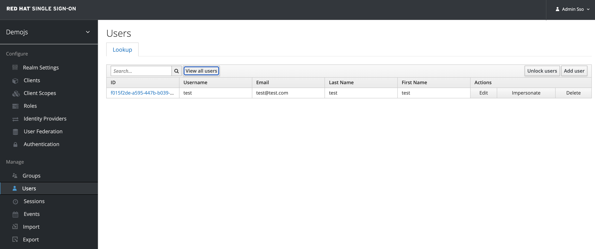

- Select the user you registered with earlier, and not the Admin user. (user 'test')
  
  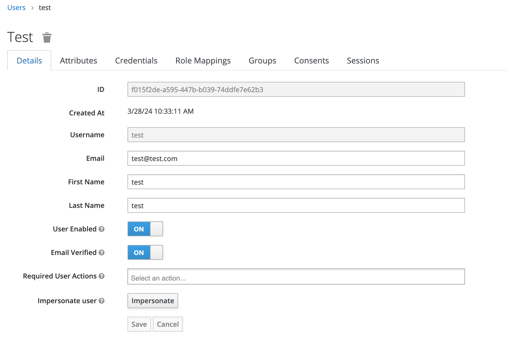

- Click on attributes and add key 'avatar_url' with value 'https://www.keycloak.org/resources/images/logo.svg'
  
  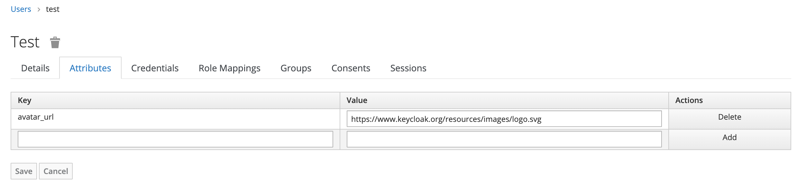

- Click Add followed by Save.
- Now Red Hat SSO knows the users avatar, but the application also needs access to this. We’re going to add this through Client Scopes.
- Click on Client Scopes then Create.

  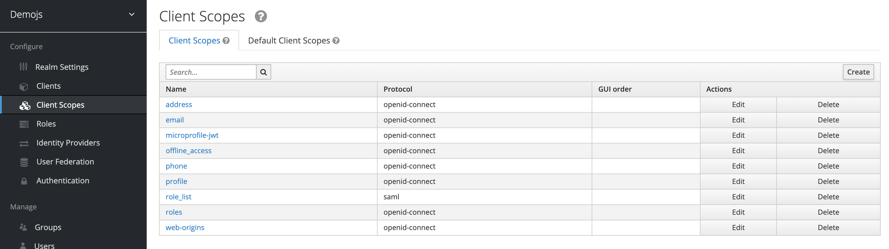

- Fill in the following values:
 
  - Name: avatar
  - Consent Screen Text: Avatar
  - Click on Save.
  
  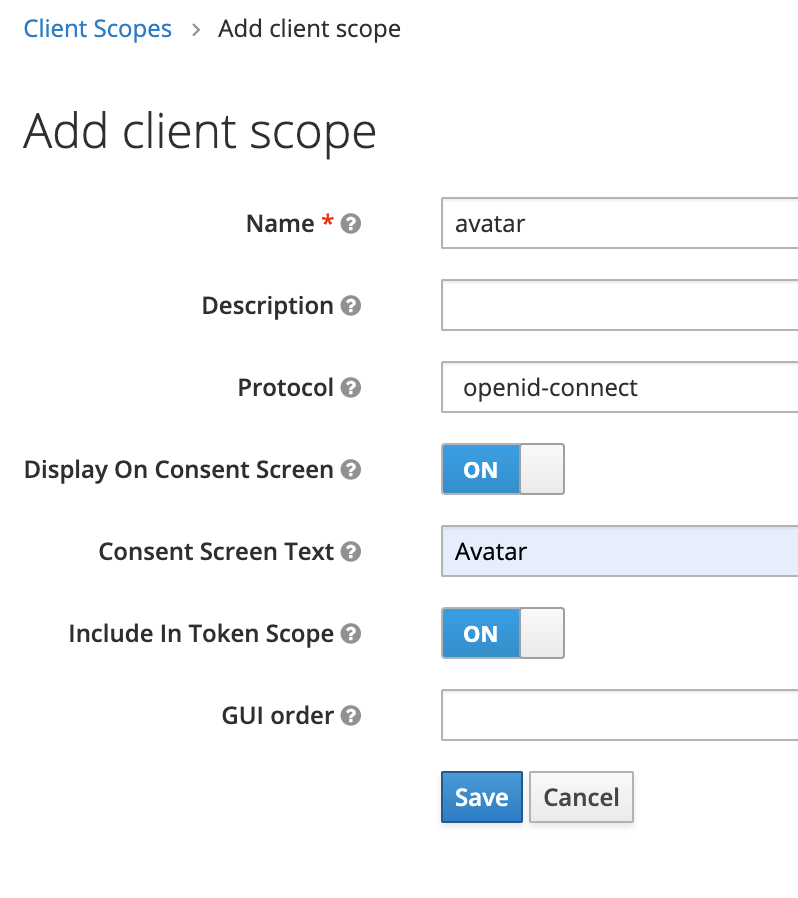

- Click on Mappers then Create.
  
  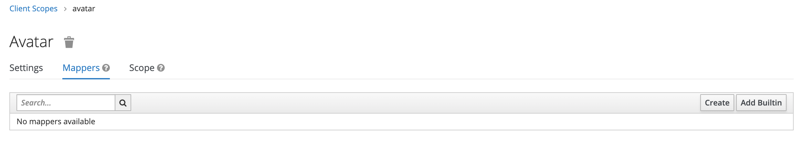

- Fill in the following values:

  - Name: avatar
  - Mapper Type: User Attribute
  - User Attribute avatar_url
  - Token Claim Name: avatar_url
  - Claim JSON Type: String
  - Click Save.
  
  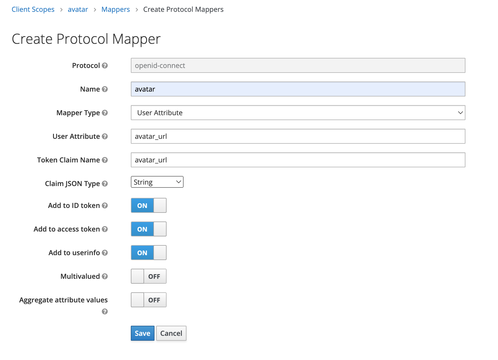

- Now we’ve created a client scope, but we also need to asign it to the client, so that our client 'js-console' can reflect the change as well.
- Go to Clients and select js-console. Select Client Scopes.
  
  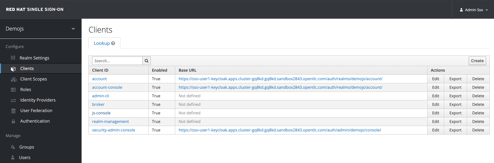

- We’re going to add it as a Default Client Scope. So select the avatar here and click 'Add selected'. As it’s a default scope it is added to the token by default, if it’s set as an optional client scope the client has to explicitly request it with the scope parameter.
  
  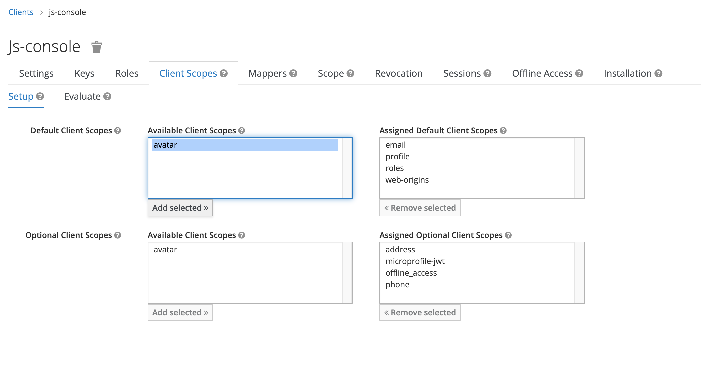

- Now go back to the JS Console and click Refresh. You should see a keycloak logo as your avatar on the main JS Console dashboard.

  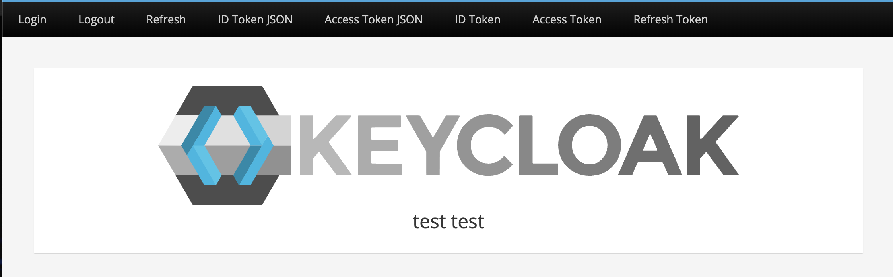

- Click on ID Token JSON and Access Token JSON links and you can see the custom attribute added into the token as well.

  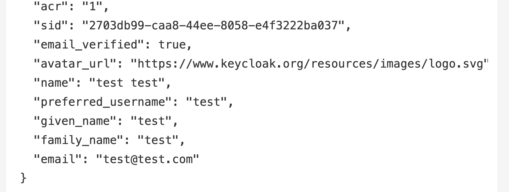

## Requiring Consent

So far we’ve assumed the JS Console is an internal trusted application, but what if it’s a third party external application? In that case we probably want the user to grant access to what the application wants to have access to.

- Open the RH-SSO Admin Console
- Go to Clients, select JS Console and turn on Consent Required. Press Save
  
  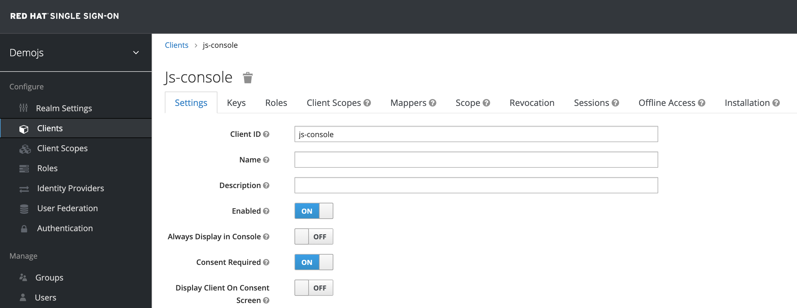

- Go back to the JS Console and click Login again.

  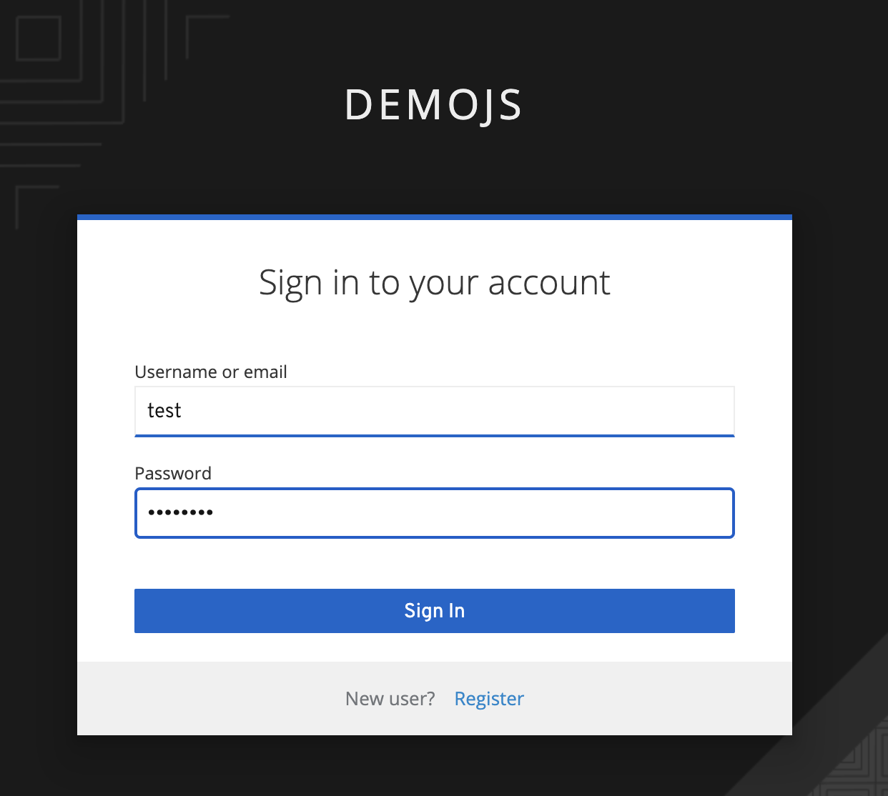

- Now you have successfully configured a consent. And you can see that it also shows the different attributes that you are consenting too. You can grant consent and should then be able to see the grants. Lets move on to learn more about that.

  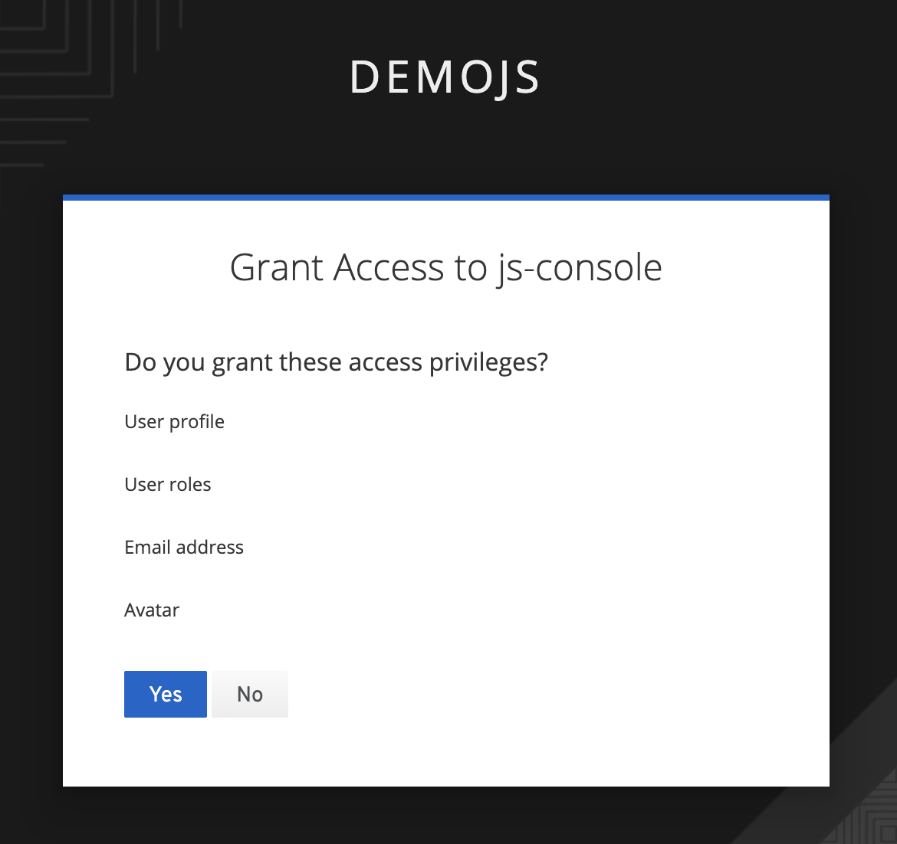

- click Yes
- You should turn this off again before continuing. Back to RH-SSO and set Consent Required Off and Save.
  
  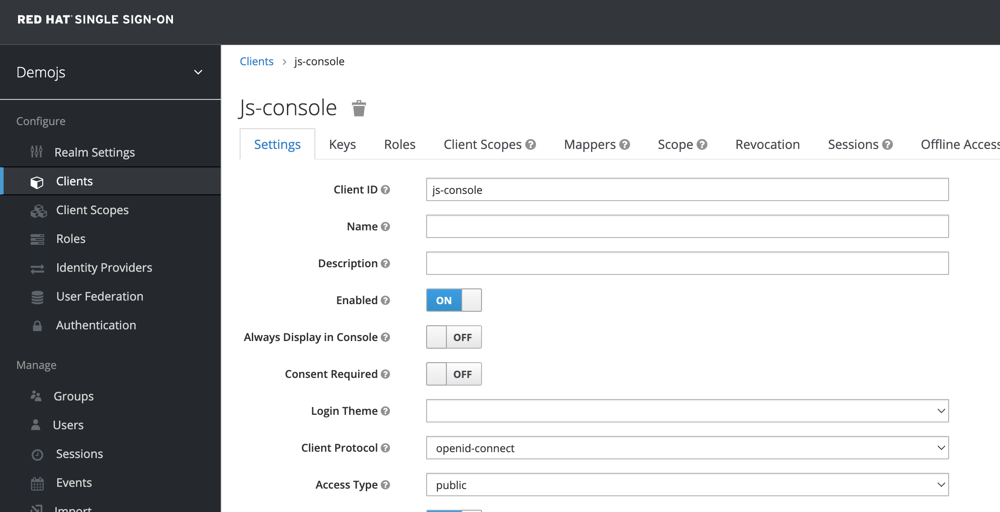
- Optional (For Remove consent, !!! You don't have to do it in this workshop.!!!): 
  - Lets say if the user didnt want to consent any longer. They could goto to the accounts page and remove the consent.
  - Hit the account portal url e.g. <SERVER_URL>/auth/realms/demojs/account e.g. https://sso-userX-keycloak.apps.cluster-t9pz8.t9pz8.sandbox502.opentlc.com/auth/realms/demojs/account (!!! change userX to your username !!!)

    

  - After Login, click Applications Link, and expand js-console applicaiton
  - You can press the Remove access and premissions will be removed.
  
    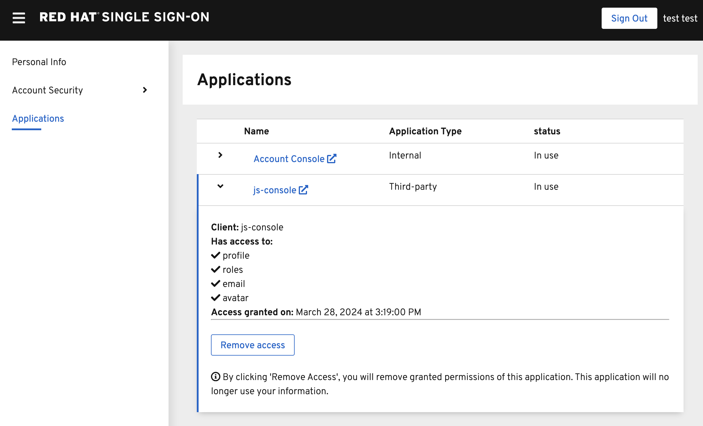

  - All the granted permissions and list of applictions will be listed. As you can see Account does not have a Consent, and hence does not offer the revoke options. This is very useful when multiple solutions an applications are connected to single sign on like Red Hat SSO.

## Let’s move on

Congratulations you have completed this exercise.

We have understood Open Id Connect

Comparision of SAML and OIDC

Configuring Client scopes, mappers and Grants.

Lets move on the next section and get into some more details.

- [Users and groups](7-usersandgroups.md)
