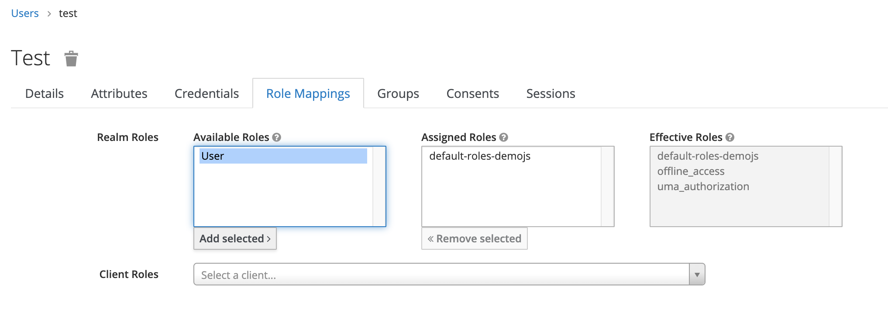

# Users and groups

You can manage users and groups in Red Hat SSO, and also import from different feredration providers e.g. LDAP and Kerberos. In this lab we only use the User, groups function provided with Red Hat SSO, and wont be importing from LDAP or Kerberos. However bear in mind that most of the customers would have an internal directory server where the users are stored. And Red Hat SSO can easily connect with them.

Red Hat SSO has supports for both roles and groups.

Roles can be added realm-wide or to specific applications. There is also support for composite roles where a role can be a composite of other roles. This allows for instance creating a default role that can be added to all users, but in turn easily managing what roles all the users with the default role will have.

Groups have a parent/child relationship where a child inherits from its parent. Groups can be mapped to roles, have attributes or just added directly to the token for your application to resolve its meaning.

## Create role

Let’s start by creating a role and see it in the token.

- Open the Red Hat SSO Admin Console.
- Click on Roles and Add Role.
  
  

- Set the Role Name to User and click `Save.

  

- Now click on Users and find the user you want to login with. (username: test, click view all users if you don't found user.)

  

- Click on Role Mappings. Select user from Available roles and click Add selected.
  
  

- Go back to the JS Console and click Refresh, then Access Token JSON.

  

- Refresh your js-console and notice that there is a realm_access claim in the token that now contains the user role.

## Create group

- Next let’s create a Group.
- Go back to the Red Hat SSO Admin Console.
  
  

- Click on New and use mygroup as the Name.
  
  

- Click on Attributes and add key 'user_type' with value 'consumers'.
  
  

- Now let’s make sure this group and the claim is added to the token.
- Go to Client Scopes and click Create.
  
  

- For the name use myscope, click save.

  

- Click on Mappers.

  

- Click on Create.

  - Fill in the following values:
  - Name: `groups`
  - Mapper Type: `Group Membership`
  - Token Claim Name: `groups`
  - Click Save then go back to Mappers and click Create again.
  
  

- Fill in the following values:
  - Name: `type`
  - Mapper Type: `User Attribute`
  - User Attribute: `user_type`
  - Token Claim Name: `user_type`
  - Claim JSON Type: `String`
  - Click Save

  

- Find the js-console client again and add the myscope as a default client scope.
  
  

  

- Finally add a user to this group, by going to the Users;
  
  

- Find your user and add group to it. (click view all group in available groups, select mygroup and click Join)
  
  

- When you login to the JS Console you will be able to see the claim.
- Go back to the JS Console and click Refresh, then Access Token JSON. Notice that there is a groups claim in the token as well as a user_type claim.
    
  

## User Federation
R
ed Hat Single Sign-On can federate external user databases. Out of the box we have support for LDAP and Active Directory.

Red Hat Single Sign-On performs federation a bit differently than other products/projects. The vision of Red Hat Single Sign-On is that it is an out of the box solution that should provide a core set of features regardless of the backend user storage you want to use. Because of this requirement/vision, Red Hat Single Sign-On has a set data model that all of its services use. Most of the time when you want to federate an external user store, much of the metadata that would be needed to provide this complete feature set does not exist in that external store. For example your LDAP server may only provide password validation, but not support TOTP or user role mappings. The Red Hat Single Sign-On User Federation SPI was written to support these completely variable configurations.

The way user federation works is that Red Hat Single Sign-On will import your federated users on demand to its local storage. How much metadata is imported depends on the underlying federation plugin and how that plugin is configured. Some federation plugins may only import the username into Red Hat Single Sign-On storage. Others might import everything from name, address, and phone number, to user role mappings. Some plugins might want to import credentials directly into Red Hat Single Sign-On storage and let Red Hat Single Sign-On handle credential validation. Others might want to handle credential validation themselves. The goal of the User Storage Federation SPI is to support all of these scenarios.

Lets move on to the next section and see how User federation works together with thirdpart identity providers.

## Let’s move on

Congratulations! You have just had the initial glimpses of the User management within Red Hat SS0 We have created a user, added scope and mappers and added them to a group. We have added claims both via user and via groups.

- [Identity providers and OAuth](8-oauth.md)