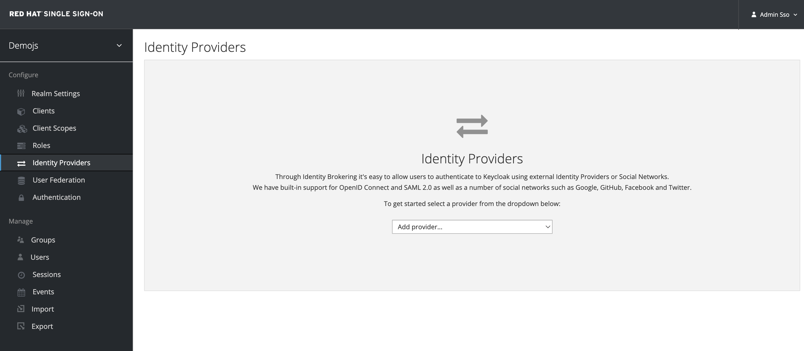
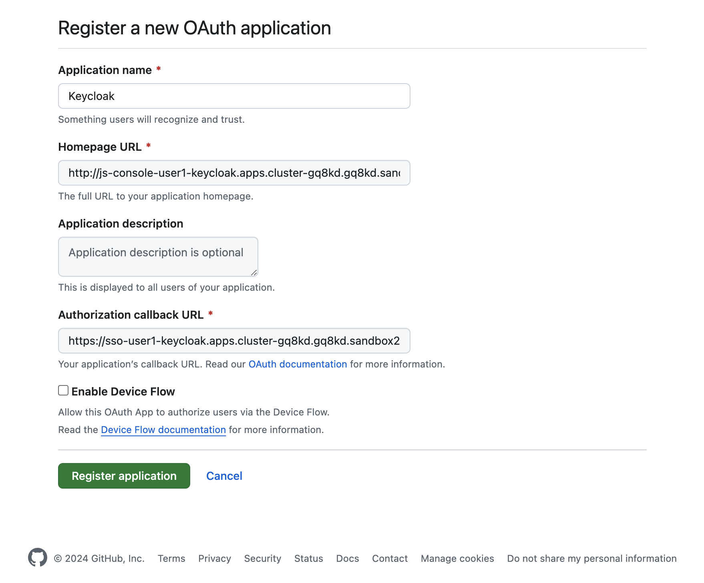
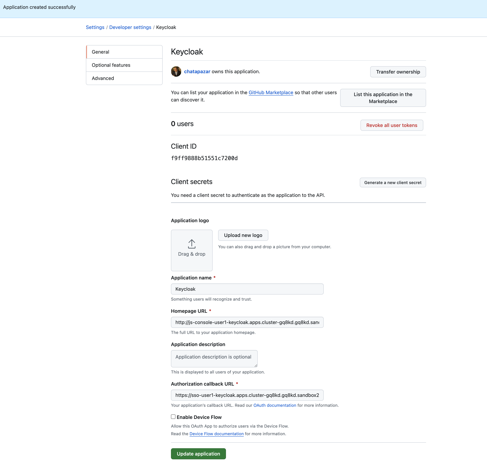
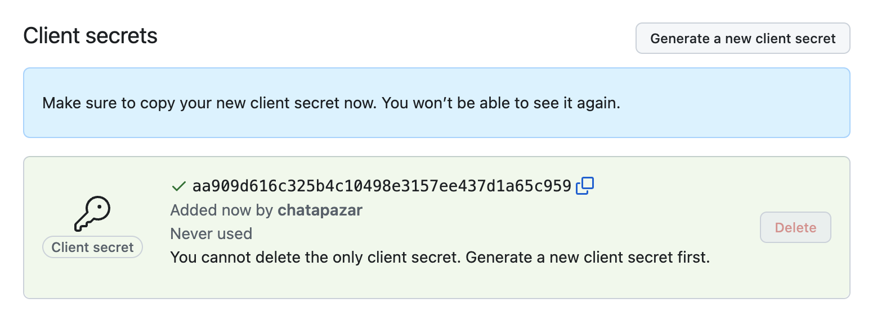
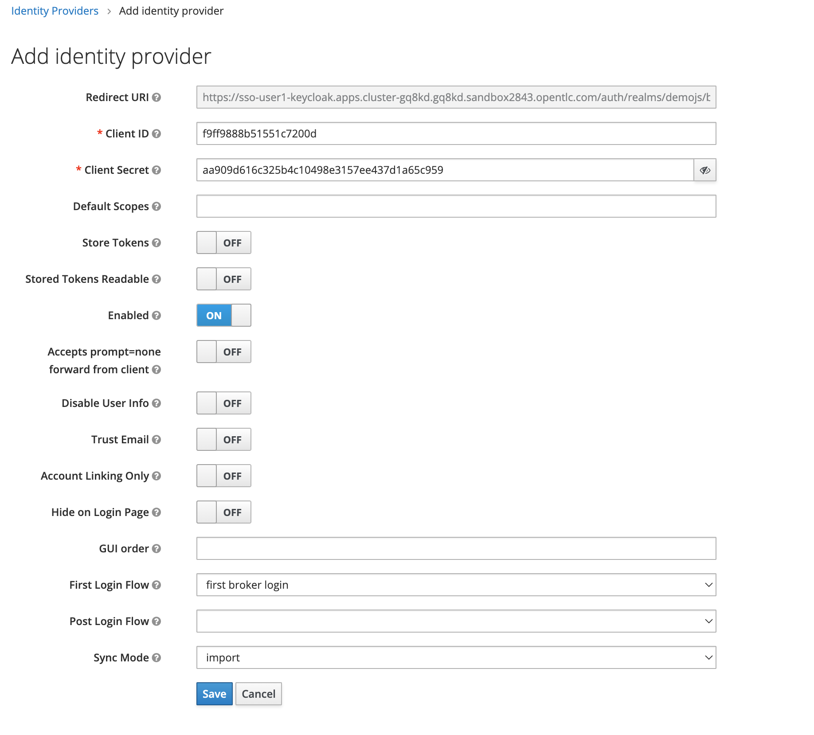
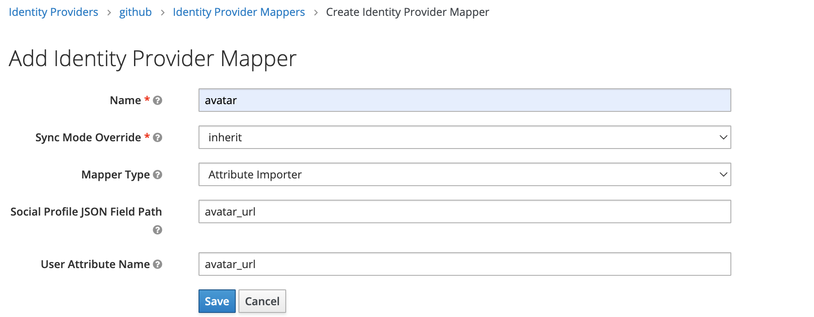
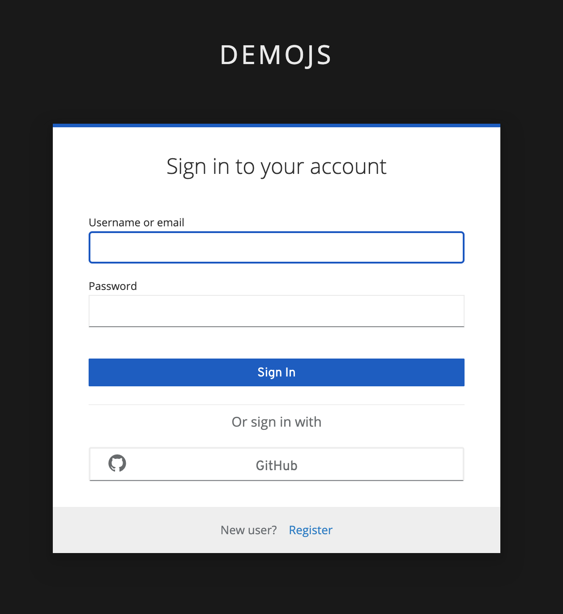
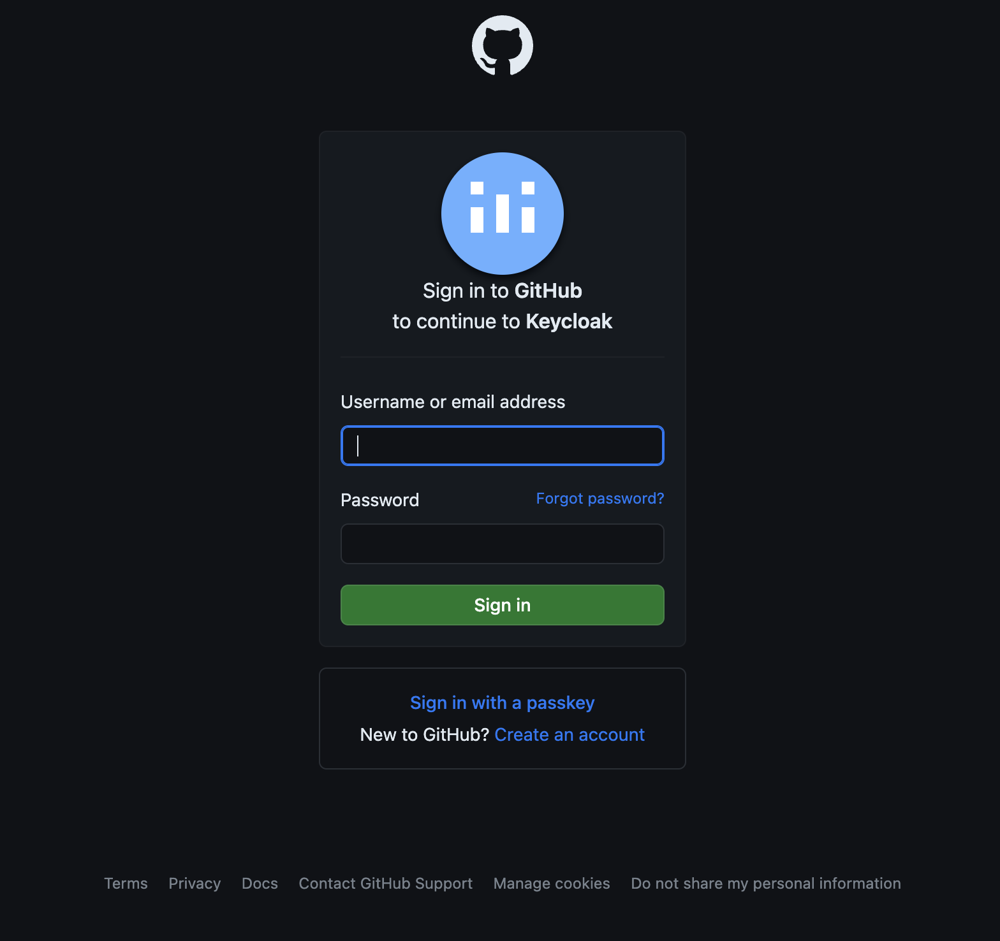
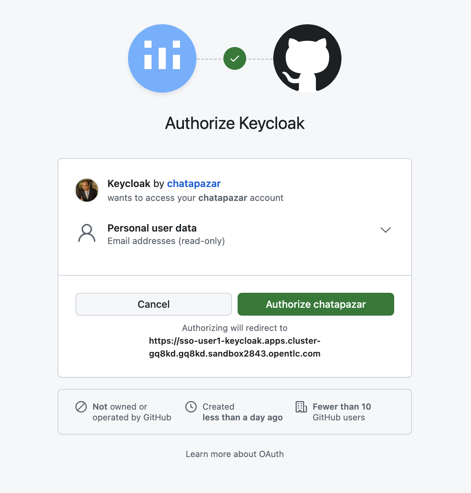

# Identity providers and OAuth

## Identity providers
An Identity Broker is an intermediary service that connects multiple service providers with different identity providers. As an intermediary service, the identity broker is responsible for creating a trust relationship with an external identity provider in order to use its identities to access internal services exposed by service providers.

When using Red Hat Single Sign-On as an identity broker, users are not forced to provide their credentials in order to authenticate in a specific realm. Instead, they are presented with a list of identity providers from which they can authenticate.

You can also configure a default broker. In this case the user will not be given a choice, but instead be redirected directly to the parent broker. The following diagram demonstrates the steps involved when using Red Hat Single Sign-On to broker an external identity provider:

1. User is not authenticated and requests a protected resource in a client application.
2. The client applications redirects the user to Red Hat Single Sign-On to authenticate.
3. At this point the user is presented with the login page where there is a list of identity providers supported by a realm.
4. User selects one of the identity providers by clicking on its respective button or link.
5. Red Hat Single Sign-On issues an authentication request to the target identity provider asking for authentication and the user is redirected to the login page of the identity provider. The connection properties and other configuration options for the identity provider were previously set by the administrator in the Admin Console.
6. User provides his credentials or consent in order to authenticate in the identity provider.
7. Upon a successful authentication by the identity provider, the user is redirected back to Red Hat Single Sign-On with an authentication response. Usually this response contains a security token that will be used by Red Hat Single Sign-On to trust the authentication performed by the identity provider and retrieve information about the user.
8. Now Red Hat Single Sign-On is going to check if the response from the identity provider is valid. If valid, it will import and create a new user or just skip that if the user already exists. If it is a new user, Red Hat Single Sign-On may ask the identity provider for information about the user if that info doesn’t already exist in the token. This is what we call identity federation. If the user already exists Red Hat Single Sign-On may ask him to link the identity returned from the identity provider with his existing account. We call this process account linking. What exactly is done is configurable and can be specified by setup of First Login Flow . At the end of this step, Red Hat Single Sign-On authenticates the user and issues its own token in order to access the requested resource in the service provider.
9. Once the user is locally authenticated, Red Hat Single Sign-On redirects the user to the service provider by sending the token previously issued during the local authentication.
10. The service provider receives the token from Red Hat Single Sign-On and allows access to the protected resource.

## OAUTH and OAUTH2

Lets say you are running an e-commerce shop online. And today you have a couple of million users. Business is growing. Now you are being approached by third-party application developers to integrate with your services; Lets assume they are running a chat service or a gaming platform, they would like to provide services to your customer and thiers. Also bringing in new business. How can we handle such an integration?

OAuth is a way to get access to protected data from an application. It’s safer and more secure than asking users to log in with passwords. OAuth will also allow developers to securely get the user data. So is OAuth an Authentication mechanism? No its not. OAuth provides the framework to securely access that data. So OAuth asks for a token and gets it. For Authentication you would use Open ID Connect or SAML etc. So rather then sharing passwords between services OAuth is te protocol that helps brings the whole RESTful web together. Similar to when one uses Google or Githhub login to use other services from like e.g. Red Hat developer

## Create Github User

- skip this part if you have github user !!!
- open browser to https://github.com
- signup

## Users from Github

Now that we have users in Red Hat SSO as well as loading users from LDAP let’s get users from an external Identity Provider. For simplicity we’ll use GitHub, but the same approach works for a corporate identity provider and other social networks.

- Open the Red Hat SSO Admin Console.
- Click on Identity Providers.
  
  

- From the drop-down select GitHub.
  
  

- In Add Identity Provider, Copy the value in Redirect URI. You’ll need this in a second when you create a new OAuth application in GitHub. (Authorization callback URL)
  
  

- In a new tab open Github to register a new OAuth application. You can do this by either going to 'account settings/developer settings' or click this [link](https://github.com/settings/developers)

  

- Click Register a new application, Fill in the following values (change userX to your user name):
  - Application name: Keycloak
  - Homepage URL: http://js-console-userX-keycloak.apps.cluster-gq8kd.gq8kd.sandbox2843.opentlc.com
  - Authorization callback URL (copy value from Redirect URI): https://sso-userX-keycloak.apps.cluster-gq8kd.gq8kd.sandbox2843.opentlc.com/auth/realms/demojs/broker/github/endpoint
  - Click Register application

  

  

- Now copy the value for Client ID from GitHub to the Red Hat SSO Admin Console.

  

- Click Generate a new client secret and copy from GitHub to the Red Hat SSO Admin Console.

  

  

- back to Github Config in RH-SSO Admin Console, Paste Client ID and Client Secret and click Save
  
  

- We also want to add a mapper to retrieve the avatar from GitHub. Click on Mappers and Create.
  
  

- Fill in the following values:
  - Name: avatar
  - Mapper Type: Attribute Importer
  - Social Profile JSON Field Path: avatar_url
  - User Attribute Name: avatar_url
  - Click Save.
  
  

- Logout from the JS Console and instead of providing a username or password to login click on GitHub.
  
  

  

  

  

  

- Notice how it automatically knows your name and also has your avatar.
- If your email address for the registered SSO user is the same as your github account, your avatar will not be updated.
- This is by design, since the SSO user takes priority if the attributes are the same. This also means if we had multiple identity providers with the same atrributes, SSO would always be updating that property rigorously.

## Let’s move on

Congratulations you have now successfully

How identity providers work in Red Hat SSO.

configured Client scopes

Added a new identity provider

Created OAuth based connection with Github and registering your SSO server as an app.

Lets move on to the next section and do some more advanced customizaton and custom code loading.

- [Advanced Configuration](9-advanced.md)