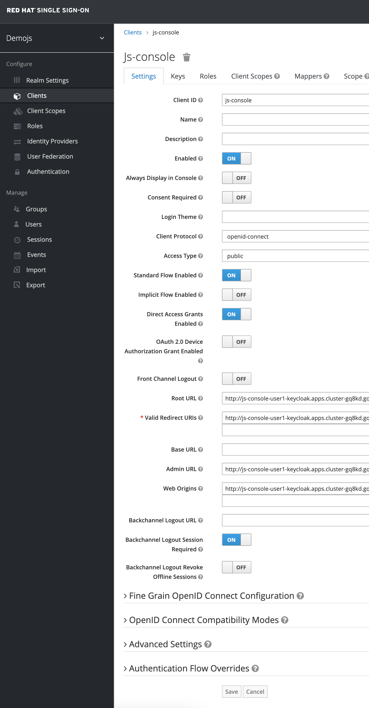

# Advanced Configuration

In this excercise lets try some of the cusomtizations Red Hat SSO has to offer.

- Keys and Signing

- Custom Code

- OTP Tokens

- Themes

## Keys and Signing

By default Red Hat SSO signs tokens with RS256, but we have support for other signing algorithms. We also have support for a single realm to have multiple keys.

It’s even possible to change signing algorithms and signing keys transparently without any impact to users. This is a powerful feature since over time, applications can change the way they authinticate.

Let’s first try to change the signing algorithm for the JS console client.

First let’s see what algorithm is currently in use.

- Open the JS Console, login with test user
  
  

- then click on ID Token. This will display a rather cryptic string, which is the encoded token.
  
  

- Copy this value, making sure you select everything.
- In a different tab open the JWT validation extension --> [jwt.io](https://jwt.io)
- paste token to Encoded text box and view data in Decoded text box

  

- What we’re interested is in the header. The field alg will show what signing algorithm is used to sign the token. It should show RS256. Great so that gives us details of the current token in use.
- Now let’s change this to this to something new, maybe ES256.
- Open the Red Hat SSO Admin Console in a new tab.
- Ensure you keep the JS Console open as we want to show how it gets new tokens without having to re-login.
- Click on Clients and select the js-console client.
  
  

  

- Under Fine Grained OpenID Connect Configuration switch Access Token Signature Algorithm and ID Token Signature Algorithm to ES256. Save.

  

- Now go back to the JS Console and click on Refresh. This will use the Refresh Token to obtain new updated ID and Access tokens.

  

- Click on ID Token, copy it and open the JWT validation extension again. Notice that now the tokens are signed with ES256 instead of RS256.
  
  

  

- While you’re looking at the ID Token take a note of the kid, try to remember the first few characters. The kid refers to the keypair used to sign the token.
- Go back to the Red Hat SSO Admin Console.
- Go to Realm Settings then Keys. What we’re going to do now is introduce a new set of active keys and mark the previous keys as no longer the active keys.
  
  
  
- Click on Providers.

  

- From the drop-down select ecdsa-generated.

  

- Set the priority to 200 and click Save. As the priority is higher than the current active keys the new keys will be used next time tokens are signed.
  
  

- Now go back to the JS Console and clik on Refresh. Copy the token to the JWT validation extension. Notice that the kid has now changed.

  

- What this does is provide a seamless way of changing signatures and keys. Currently logged-in users will receive new tokens and cookies over time and after a while you can safely remove the old keys without affecting any logged-in users.

## Sessions

- Make sure you have the JS Console open in a tab and you’re logged-in. Open the Red Hat SSO Admin Console in another tab.

  

- Find the user you are logged-in as and click on Sessions. Click on Logout all session.

  

- Go back to the JS Console and click Refresh. Notice how you are now longer authenticated.

  

  

- Not only can admins log out users, but users themselves can logout other sessions from the account management console. You can go to the following link to access your account. <SERVER_URL>/auth/realms/demojs/account

## Events

Events are the system wide events, you can see each event regarding the events, e.g. is someone tried to login with wrong credentials and alot more. These details are important e.g. auditing or compliance usecases as well.

- Open the Red Hat SSO Admin Console.
- Click on Events and Config.

  

- Turn on Save Events and click Save.
- Go back to the JS Console and click Refresh. Logout.
- Then when you log in use the wrong password, then login with the correct password.
- Go back to the Events in the Red Hat SSO Admin Console and notice how there are now a list of events.

  

Not only can Red Hat SSO save these events to be able to display them in the admin console and account management console, but you can develop your own event listener that can do what you want with the events.

## Themes

We didnt cover details on the Themes in this section, but you should now be able to change the theme in the realm settings. Try it out!

  

  

## Let’s move on

Lets head off to the next section where we will create our first Quarkus books service and secure it with Red Hat SSO.

- [Securing Cloud Native Apps (Optional!!!)](10-secure.md)